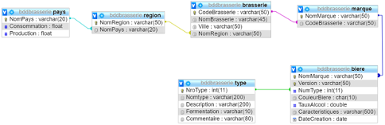

# TD 2 SQL : Base de données Brasserie

## Objectif
Ecrire des requêtes de selection spécifiques sur la base de données définit par le schema suivant

## Démarrage
- Cloner le projet
- Démarrage des conteneurs docker `docker compose up -d`

## Requêtes à effectuer

1.	Le nombre de régions par nom de pays.
2.	Le nombre de bières (marque) par nom de pays
3.	Quels sont les noms de pays qui ont plus de 10 bières
4.	Quel est le taux d’alcool des bières en moyenne.
5.	Quels sont les noms de villes qui ont au moins 2 brasseries.
6.	Quels sont les noms de brasseries qui proposent une bière de couleur « blonde » avec un taux d’alcool supérieur à 11 degrés.
7.	Quels sont les taux d’alcool + versions des bières allemandes. La liste sera triée de façon croissante sur le taux d’alcool.
8.	Quels sont les noms de types de bières qui ont plus de 15 marques de bière.
9.	Quels sont les noms de pays qui proposent des bières blondes avec un taux d’alcool supérieur ou égal à 9.
10.	Quel est le nombre de bières qui n’ont pas de caractéristiques au mois d’avril 2006.
11.	Le nombre de brasseries par nom de régions pour lesquelles il y a plus de 5 brasseries.
12.	La liste des bières (marque + version + taux), triée de façon décroissante par le taux d’alcool, allemandes de couleur « Brune » ayant un taux d’alcool supérieur à 5.

